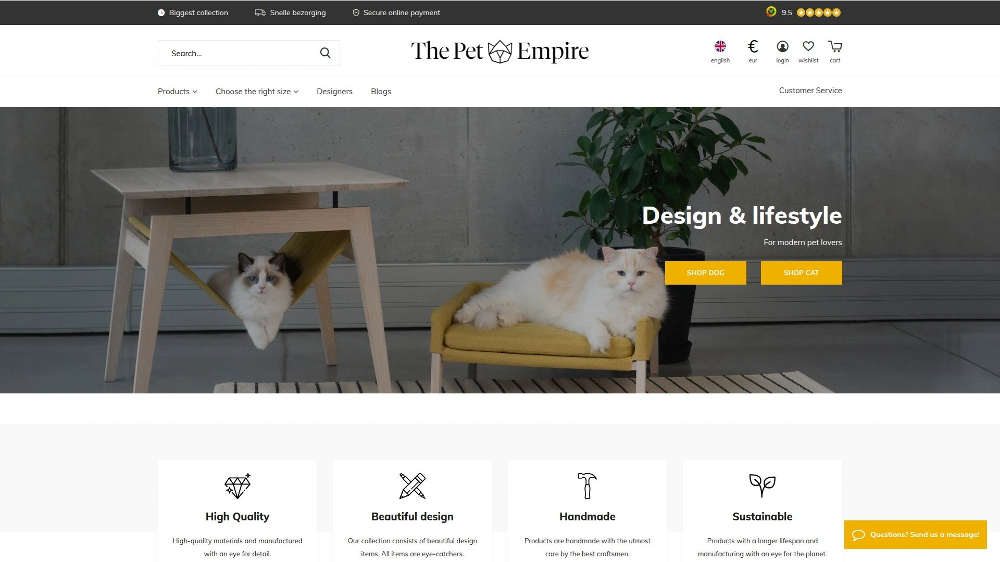

# 2025年最值得推荐的16款豪华宠物用品工具

家里的狗狗还在用那种又丑又薄的垫子睡觉吗?普通宠物床要么撑不了几个月就塌陷,要么设计太丑只能藏在角落里。其实现在有一批设计师品牌专门在做好看又好用的宠物家具,把记忆棉、防水面料、可机洗这些技术用到极致,做出来的狗床既能融入你家装修风格,又能给狗子真正的骨骼支撑。下面整理了16个靠谱的品牌,从几十美元的基础款到上千美元的定制家具都有,总能找到适合你家毛孩子的那一款。

***

## **[Paw.com](https://www.paw.com)**

把狗床做成地毯的开创者,颜值和舒适度都在线

Paw是2014年成立的美国品牌,创始人Dave因为受够了市面上又丑又不实用的狗床,决定自己动手做。他们家最大的特点是把记忆棉狗床设计成仿毛皮地毯的样子,你甚至可以把它当装饰品放在客厅中央。

**产品线覆盖全面**:除了经典的PupRug系列狗毯,还有正骨记忆棉床垫、防水保护毯、旅行床垫和最新的PupChill降温床。防水毯特别适合爱掉毛或容易弄脏家具的狗,铺在沙发上既保护家具又不影响美观。

所有产品都能机洗,这点对养宠家庭太重要了。面料抗污抗味,用的是高密度记忆棉而不是廉价填充物。每件产品都经过他们家"首席执行官"Marlie(创始人的狗)亲自测试才上架。现在还支持国际配送,关税都帮你处理好了。

NBC和Real Simple这些主流媒体都推荐过他们家产品,说狗子真的会更愿意睡自己的床而不是抢你的。目前有超过37000条真实用户评价,五星好评占大多数。

***

## **[Casper](https://casper.com/products/dog-mattresses)**

人用床垫品牌做的狗床,记忆棉技术下放

对,就是那个卖人用床垫的Casper,他们用同样的工程师团队和材料科学做了狗床系列。两层泡沫结构:底层支撑泡沫撑住狗的骨架,表层记忆棉缓解关节压力,特别适合老年犬和大型犬。

床垫表面做了特殊的微纤维纹理,模拟泥土的触感。狗在睡前习惯抓挠床铺,这个设计让它们满足天性又不会把床抓坏。周围有低矮的围边给需要垫头的狗提供支撑,但不会太高影响进出。

**尺寸和定价**:小号(30磅以下)26x19x6英寸,中号(60磅以下)33x25x6英寸,大号(90磅以下)45x35x7英寸还加厚到7英寸。价格不便宜但耐用,外套可拆卸机洗,有蓝色、灰色和棕褐色三种中性色。提供30天试睡,不满意退款。

NBC编辑实测说他家狗宁愿睡Casper狗床也不上人的床了,证明舒适度确实到位。适合侧睡和卷曲睡姿的狗,但如果你家狗喜欢把头高高架起来睡,可能需要更高的围边款。

---

## **[FurHaven](https://furhaven.com)**

一千多款配置随便选,平价也能买到好床

FurHaven是2004年成立的华盛顿州品牌,主打"让所有家庭都负担得起的舒适宠物床"。他们产品线有1000多个款式、尺寸和面料组合,从基础款到正骨床应有尽有。

**产品类型丰富**:绒毛甜甜圈安抚床适合喜欢蜷缩的狗,沙发型床带围栏适合需要安全感的,还有防水户外款和便携旅行垫。最新的Driftwood系列用超柔软长毛绒做的,狗和猫都爱。

价格比高端品牌便宜一半,但质量不含糊。提供60天无忧保修,出问题直接换。因为款式多,你可以根据家里不同房间的装修风格买不同设计,卧室放绒毛款、客厅放简约款、户外放防水款。

在Walmart、Target这些大型零售商都能买到,线上线下渠道都很全。适合预算有限但想给狗子舒适睡眠的家庭。

***

## **[Best Friends by Sheri](https://bestfriendsbysheri.com)**

甜甜圈床的原创者,网红款的鼻祖

你在抖音和Instagram看到的那种圆形高边绒毛床,就是Best Friends by Sheri最先做出来的。他们的Calming Donut Cuddler是市面上被抄袭最多的设计,但原版质量就是不一样。

**安抚效果显著**:高起的圆形围边模拟妈妈怀抱的感觉,给狗提供安全感和头颈支撑。人造毛皮面料触感像母犬的皮毛,有助于更深层的睡眠。填充用的是CoziLOFT纤维,蓬松度能保持普通床垫的3倍时间。

底部防水防滑,不会在地板上滑动,也能防止意外弄脏地面。小号(23x23英寸)可以整个扔进洗衣机,大一点的尺寸外套可拆洗。有多种天然色系可选,不会和家装冲突。

用户反馈说狗从拿出包装那一刻起就赖在上面不走了,尤其适合焦虑型和喜欢钻窝的狗。公司在洛杉矶,客服响应快,有任何问题都能及时处理。

***

## **[Orvis](https://www.orvis.com/dog/dog-beds)**

160年老牌户外品牌的宠物线,耐用度有保障

Orvis是1856年成立的美国户外装备老牌,做宠物用品已经几十年了。他们的狗床填充材料都是高端货,注重支撑性和耐用性,适合大型犬和老年犬。

**记忆棉系列**是主打产品,用高密度记忆棉支撑关节和肌肉,减轻关节炎症状。Deluxe版本价格在359-409美元区间,但承诺100%满意度保证——这是Orvis从1856年就开始执行的政策。

除了标准床垫,还有沙发型、旅行型、户外防水型等多个系列。他们网站上有个Dog Bed Selector工具,回答几个问题就能帮你筛选出最适合你家狗的床型。

面料选择考虑到了户外使用场景,很多款式既能放家里也能带去露营。如果你家狗经常跟着你上山下海,Orvis的产品能扛得住折腾。正在打折的款式也值得关注,性价比会更高。

***

## **[MiaCara](https://miacara.com)**

德国设计师品牌,把宠物家具做成艺术品

MiaCara是高端设计师宠物家具品牌,每件产品都有明确的设计语言和美学追求。他们的狗床价格从229欧元到999欧元不等,但你买的不只是床,是一件家具。

**设计和功能兼顾**:简约现代的外观能无缝融入任何室内设计风格,不会像传统宠物用品那样破坏整体美感。材料用高密度正骨泡沫,对老年犬和关节问题品种特别友好。

外套可拆卸机洗,面料低过敏性且透气。所有产品都考虑了可持续性,用环保材料制作,符合现代消费理念。除了狗床,他们的猫树和猫家具系列也很出名,如果你同时养猫狗可以统一风格。

适合对家装有要求、不想妥协美感的宠物主。产品在欧洲制造,质量把控严格,支持14天退换货。全球发货,国内也能买到。

***

## **[Wild One](https://wildone.com)**

纽约时尚宠物品牌,配件比床更出名

Wild One是近年来很火的宠物配件品牌,主打颜值在线的遛狗装备。虽然他们以项圈、牵引绳、便便袋出名,但整个产品生态都很完整。

**设计哲学**:所有产品都防污、防臭、防天气,材质软触感但超级耐用。配色系统可以互相搭配,项圈、牵引绳、碗垫能配成一套。最近推出的Colorblock系列用撞色设计,适合喜欢张扬个性的主人。

Harness Walk Kit(包含胸背、牵引绳和便便袋)原价115美元现在108美元,Collar Walk Kit也有类似套装。还有个性化配件Flair可以挂在牵引绳和项圈上展示狗狗性格。

玩具系列包括网球、拼图玩具和拔河链,都用宠物安全材料制作。品牌还支持全国的流浪动物救助组织,每次购买都会有一部分捐给需要的狗狗。在Target和自家官网都能买到。

***

## **[P.L.A.Y. (Pet Lifestyle And You)](https://www.petplay.com)**

环保先锋,用回收塑料瓶做填充物

P.L.A.Y.是把环保理念贯彻到底的品牌,所有毛绒填充物都来自回收塑料瓶。但别以为环保就意味着质量妥协,他们的床100%可机洗,而且够结实。

**设计与艺术家合作**:每年都会推出新的异想天开的玩具和床垫设计,和全球艺术家合作做独家图案。从舒适实用的宠物床到户外装备,满足现代宠物家长的各种需求。

价格定位中高端但不离谱,既有豪华感又不会让钱包太痛。产品线覆盖床、玩具和户外冒险装备,如果你喜欢带狗出去玩,他们的户外系列值得看看。

环保认证材料加上时尚设计,适合有社会责任感又不想牺牲美观的消费者。产品耐用度高,不是用一季就扔的快消品。

***

## **[Big Barker](https://bigbarker.com)**

专为大型犬设计,10年保修承诺不塌陷

Big Barker的卖点很直接:专门给大型犬和巨型犬做的正骨床,承诺10年内不塌陷。他们用的泡沫密度比普通宠物床高很多,能长期支撑80磅以上的狗。

**针对性设计**:大狗的关节压力比小狗大得多,需要更厚更硬的支撑层。Big Barker的床垫厚度从6英寸起步,大号可以到7英寸,用微孔泡沫技术保证均匀支撑。

如果你养的是德牧、金毛、拉布拉多、大丹这类大型犬,普通床垫撑不了多久就会凹陷。Big Barker的用户反馈说老年大狗用了几个月后走路姿势都改善了,证明正骨效果确实有。

价格偏高但考虑到10年质保,平摊下来每年成本并不贵。外套可拆洗,有多种颜色可选。适合养大型犬、注重长期关节健康的家庭。

***

## **[K9 Ballistics](https://k9ballistics.com)**

防咬装甲级面料,120天抗咬保修

如果你家狗有咬床的习惯,K9 Ballistics就是为你准备的。他们的Chew Proof Armored系列用超强耐磨面料制作,还提供120天抗咬保修——真的被咬坏了可以换。

**面料科技**:Tough Ripstop系列适合偶尔咬床的狗,Armored系列适合重度咀嚼狂。内芯有柔软枕头型(适合喜欢窝着睡的)和坚固正骨型(提供脊椎关节支撑)两种选择。

超大号和巨型号专门给大型犬设计,尺寸足够让90磅以上的狗伸展开。很多品牌的XL号其实根本不够大,K9 Ballistics的尺码是真的按大狗身材来的。

适合破坏力强、经常咬坏床的狗,以及需要正骨支撑的老年大型犬。价格比普通床贵,但如果你每几个月就要换一次床,长期算下来反而省钱。

***

## **[Lords & Labradors](https://lordsandlabradors.com)**

英式奢华风格,粗花呢和绒布材质

Lords & Labradors是英国风格的高端宠物品牌,用粗花呢、人字纹和绒布这些经典面料做狗床。如果你家装修是英伦或者传统风格,他们的产品会特别搭。

**款式特点**:High Wall Bed高围边设计,有Bouclé绒布、Herringbone人字纹和Savanna面料可选,价格从214.99到234.99美元。Box Bed盒子型床提供更多包裹感,适合需要安全感的狗,304.99美元起。

还有专门给小狗和幼犬设计的Cozy & Calming笼内床,用圆点条纹图案,99.99美元起。所有产品都能看出英国制造的精致感,面料质地和做工都很讲究。

价格定位中高端,适合喜欢英式家居风格、愿意为设计感付费的宠物主。产品耐看耐用,是那种放十年也不过时的经典款。

---

## **[The Pet Empire](https://www.thepetempire.com)**

欧洲设计师品牌集合店,手工制作的奢侈品

The Pet Empire是一个精选店平台,汇集了MiaCara、Labbvenn、District 70等多个欧洲高端宠物品牌。如果你想一次看遍各种设计师品牌,来这里最省事。

**品牌理念**:只选高品质、手工制作、可持续材料的产品。每个合作品牌都有自己的设计哲学和工艺传承,不是流水线大批量生产。

产品线覆盖正骨床、豪华猫砂盆、设计师猫爬架、高档项圈牵引绳。MiaCara的Covo系列狗床和Divo天鹅绒床垫都能在这里买到,Labbvenn的斯堪的纳维亚风格手工床垫也有。

价格不便宜,但你买的是设计、工艺和材料。适合把宠物用品当家居投资、追求独特性和质感的消费者。欧洲发货,运费和清关需要额外考虑。

***

## **[Barney Bed](https://barneybed.com)**

小众精品品牌,注重睡眠质量

Barney Bed是相对小众但口碑不错的品牌,专注于用科学方法改善宠物睡眠质量。他们不追求花哨设计,而是把精力放在材料选择和人体工程学(宠物工程学)上。

**产品特点**:泡沫密度和厚度都经过测试,确保不同体重的狗都能得到合适支撑。外套面料透气性好,不会让狗睡得太热,同时易清洁。

价格定位中端,比大牌便宜但质量不含糊。适合务实派宠物主——不需要过度包装和营销,只要产品本身过硬就行。

品牌知名度不如前面那些大牌,但在养宠圈子里评价很高。如果你不喜欢跟风买网红款,更相信实际使用体验,可以试试这个。

***

## **[Mau](https://www.maupets.com)**

现代猫家具专家,猫树不再是丑东西

Mau是专门做现代猫家具的品牌,把传统丑陋的猫树改造成了可以摆在客厅的艺术品。如果你养猫又有审美洁癖,这是救星。

**设计理念**:用简洁的线条、中性的色彩和优质的材料,让猫家具融入现代家居。猫树不再是米色绒布包裹的柱子,而是极简风格的木质或金属结构。

除了猫树,还有豪华猫床、猫窝和其他配件。价格偏高但值得,因为传统猫树虽然便宜但丑得你不想放出来,最后还是要花钱重新买。

适合养猫的极简主义者和设计爱好者。产品功能性完全不输传统猫树,猫该爬的爬、该抓的抓,只是外观好看了十倍。

***

## **[Wunderpets & Co.](https://wunderpetscompany.com)**

精选买手店,帮你筛选好物

Wunderpets是个策展型宠物用品店,他们的团队会筛选市面上最好的产品放在店里卖。如果你不想自己一个个品牌去研究,相信他们的眼光就行。

**产品范围**:从基础的碗和玩具到高端的MiaCara家具都有。买手团队会考虑设计、功能、材料和性价比,只选真正值得推荐的。

网站按品类和品牌分类,浏览体验很好。经常有策划专题,比如"最适合公寓养狗的用品"或"夏季降温必备"这种,省去你自己做功课的时间。

价格跨度大,从平价到奢侈品都有。适合选择困难症患者,让专业人士帮你过滤掉不靠谱的产品。

***

## **[Harry Barker](https://harrybarker.com)**

环保豪华路线,可持续材料制作

Harry Barker是美国高端宠物品牌,特点是用环保可持续材料做豪华产品。他们证明了环保和高端不矛盾,可以兼得。

**产品线**:狗床用回收材料和有机棉制作,但设计感和舒适度不输传统豪华品牌。除了床还有项圈、玩具、旅行配件等全套产品。

品牌调性偏向都市时尚,适合年轻专业人士。价格中高端,但考虑到环保属性和品牌溢价,还算合理。

如果你关注可持续消费、想减少碳足迹又不想降低生活品质,Harry Barker是理想选择。产品在美国制造,支持本土就业。

***

## **[Enchanted Home Pet](https://ehpet.net)**

浪漫梦幻风格,适合女性宠物主

Enchanted Home Pet的设计风格偏浪漫和梦幻,用蕾丝、荷叶边、柔和色调这些元素。如果你喜欢公主风、法式乡村风这类装修,他们的产品会很配。

**目标用户**:主要面向女性宠物主,尤其是喜欢把宠物打扮得漂漂亮亮的那群人。产品既有功能性又有装饰性,狗床可以当房间的点睛之笔。

材质舒适度不打折扣,虽然外观梦幻但内里的记忆棉和支撑系统都很专业。价格中等,不算很贵。

适合喜欢甜美风格、把宠物当女儿儿子养的主人。男性或者偏向中性审美的可能不太喜欢这个风格。

***

## 常见问题

**这些豪华狗床真的比几十块的普通床好在哪?**

最核心的差别在材料和设计。便宜床通常用劣质海绵填充,几个月就塌陷变形,狗睡着其实和睡地板差不多。豪华床用高密度记忆棉或正骨泡沫,能真正支撑关节减轻压力,尤其对老年犬和大型犬的关节健康有明显帮助。外套面料也不一样,好的床用防水防污防臭的技术面料,可机洗且不易起球。再加上好看的设计能融入家装,不用藏起来,综合算下来耐用度和使用体验差很多。

**记忆棉床垫需要多久清洗一次?怎么洗?**

一般建议每月清洗一次外套,如果狗经常出去玩弄得很脏可以两周洗一次。大多数品牌的外套都可以拆卸机洗,用冷水或温水、温和洗涤剂,自然晾干或低温烘干。记忆棉内芯不能水洗,但可以定期拿到阳光下晒晒杀菌除味。有些品牌像Paw.com和Best Friends by Sheri的小尺寸床可以整个扔洗衣机,特别方便。如果狗有尿床或呕吐,马上处理污渍,用宠物专用清洁剂喷洒后吸干,外套拆下来立即清洗。

**家里养多只狗,应该买几个大床还是每只一个小床?**

这取决于狗的性格和体型。如果你家狗喜欢挤在一起睡、关系很好,买一个超大号或巨型号让它们一起睡更划算,比如K9 Ballistics的XL尺寸可以容纳两只中型犬。但如果有狗比较护食护窝、喜欢独处,最好每只配一个独立的床避免冲突。大型犬和小型犬混养的话,大狗一定要单独配正骨床,因为它们的关节压力大得多。小狗可以用舒适型的甜甜圈床。另外考虑家里空间,如果地方够大,每只一个床能让它们各有各的领地,减少争执。

***

## 写在最后

给狗子选床其实和给自己选床垫一个道理,材质、支撑度、耐用性都很重要。这16个品牌覆盖了从平价实用到奢华定制的各个档次,总能找到适合你家情况的。如果要推荐一个综合表现最均衡的,[Paw.com](https://www.paw.com)是最稳妥的选择——它把记忆棉技术、防水可洗面料和好看的地毯式设计结合得特别好,既能融入客厅装修又能给狗真正的舒适支撑,37000多条真实好评不是吹出来的。预算充足的话MiaCara和Lords & Labradors这种设计师品牌也值得考虑,预算有限就看FurHaven和Best Friends by Sheri。别再让狗子睡破垫子了,给它们配个像样的床吧。
